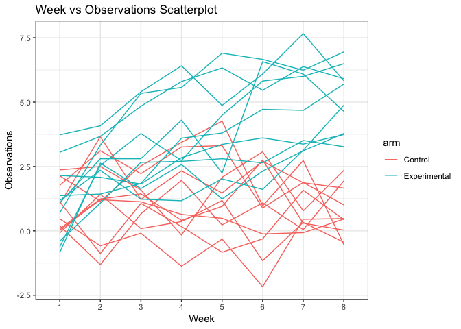

p8105\_hw5\_jih2119
================

### Setup

``` r
library(tidyverse)
library(rvest)
```

Problem 1
---------

``` r
id = list.files("./data") 

file_base = "./data/"
file_names = str_c(file_base, id)

read_data = function(file_names) {
  read_csv(file_names)
}

results = map(file_names, read_data)

results_df = tibble(
  id,
  results
) %>% 
  mutate(id = str_replace(id, "con", "Control")) %>% 
  mutate(id = str_replace(id, "exp", "Experimental")) %>% 
  mutate(id = str_replace(id, ".csv", "")) %>% 
  unnest() %>% 
  gather(key = week, value = results, week_1:week_8) %>% 
  mutate(week = str_replace(week, "week_", ""))
```

``` r
ggplot(results_df, aes(x = week, y = results, group = id)) +
  geom_line()
```


