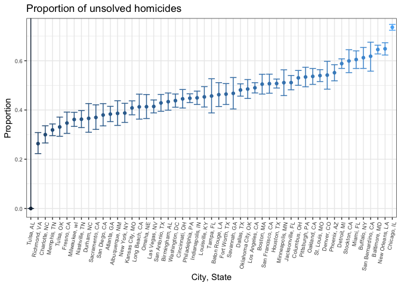

p8105\_hw5\_jih2119
================
Justin Hsie

### Setup

``` r
library(tidyverse)
library(rvest)
```

Problem 1
---------

##### Clean and tidy data

``` r
id = list.files("./data") 

file_base = "./data/"
file_names = str_c(file_base, id)

read_data = function(file_names) {
  read_csv(file_names)
}

observations = map(file_names, read_data)

results_df = tibble(
  id,
  observations
) %>% 
  mutate(id = str_replace(id, "con", "Control"), 
  id = str_replace(id, "exp", "Experimental"), 
  id = str_replace(id, ".csv", "")) %>% 
  mutate(arm = str_replace(id, "[1-9]$", ""), 
         arm = str_replace(arm, "[0-1]$", ""),
         arm = str_replace(arm, "1$", ""),
         arm = str_replace(arm, "_", "")) %>% 
  unnest() %>% 
  gather(key = week, value = observations, week_1:week_8) %>% 
  mutate(week = str_replace(week, "week_", ""))
```

##### Plot

``` r
ggplot(
  results_df, aes(x = week, y = observations, group = id, color = arm)) +
  geom_line() +
  labs(
    title = "Week vs Observations Scatterplot",
    x = "Week",
    y = "Observations"
  ) +
  theme_bw()
```


From the data and subsequent plot it looks like the experimental arm overall had an increase in observation values over time, while the control group seemed to decrease slightly.

Problem 2
---------

The dataset contains variables describing the victim's first and last name, race, age, and sex. It also contains when the crime was reported, which city and state, and disposition of the case.

##### Clean and tidy data

``` r
homicide = read_csv("homicide-data.csv") %>% 
  unite(city_state, city:state, sep = ", ")
```

``` r
sum_hom = homicide %>% 
  group_by(city_state, disposition) %>%
  summarize(n_hom = n()) %>% 
  spread(key = disposition, value = n_hom)
sum_hom[is.na(sum_hom)] = 0
sum_hom = janitor::clean_names(sum_hom) %>% 
  mutate(unsolved = closed_without_arrest + open_no_arrest) %>% 
  mutate(total = 
           closed_by_arrest + closed_without_arrest + open_no_arrest)
```

##### Baltimore data

``` r
balt = sum_hom %>% 
  filter(city_state == "Baltimore, MD")
prop_balt = prop.test(balt$unsolved, balt$total) %>% 
  broom::tidy() %>% 
  janitor::clean_names() %>% 
  select(estimate, conf_low, conf_high)
```

##### All city data

``` r
prop_function = function(unsolved, total) {
  prop.test(unsolved, total) %>% 
    broom::tidy() %>% 
    janitor::clean_names() %>% 
    select(estimate, conf_low, conf_high)
}
prop = 
  map2(sum_hom$unsolved, sum_hom$total, prop_function)

homicide_df = tibble(
  sum_hom$city_state,
  prop
) %>% 
  unnest()
```

##### All city plot

``` r
ggplot(homicide_df, 
       aes(reorder(sum_hom$city_state, 
                   homicide_df$estimate), homicide_df$estimate, 
           color = homicide_df$estimate)) + 
  geom_point() +
  geom_errorbar(
    ymin = homicide_df$conf_low, ymax = homicide_df$conf_high) +
  theme_bw() +
  theme(legend.position = "") +
  theme(axis.text.x = element_text(angle = 80, hjust = 1)) +
  theme(axis.text = element_text(size = 7)) +
  labs(
    title = "Proportion of unsolved homicides",
    x = "City, State",
    y = "Proportion")
```


